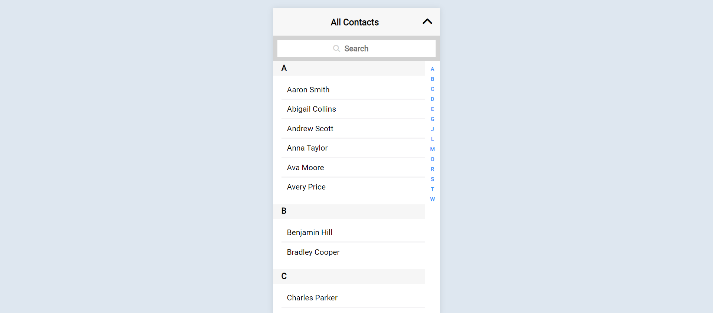
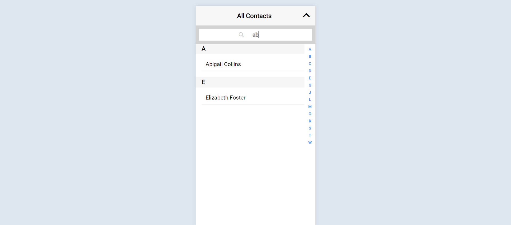

# Contact Picker Plugin
A simple contact picker plugin which consists of: 
1) List of contact names sorted alphabetically 
2) Search option
3) Quick navigation bar on the right
4) Toggle button to expand and collapse the contact picker

## How to run: 
1. Clone the repository using:  
```bash
git clone https://github.com/AnnaSmith3110/contact-picker-plugin.git
```
2. Run a Live Server or Open the index.html file

To change the contact data, edit the contacts.json file and load your own data.

## Screenshots: 
1. Collapsed View 
2. Expanded View 
3. Search View 

## Live Demo Available Here 
https://contact-picker-plugin-fyd85rvgi-annasmith3110.vercel.app/ 
